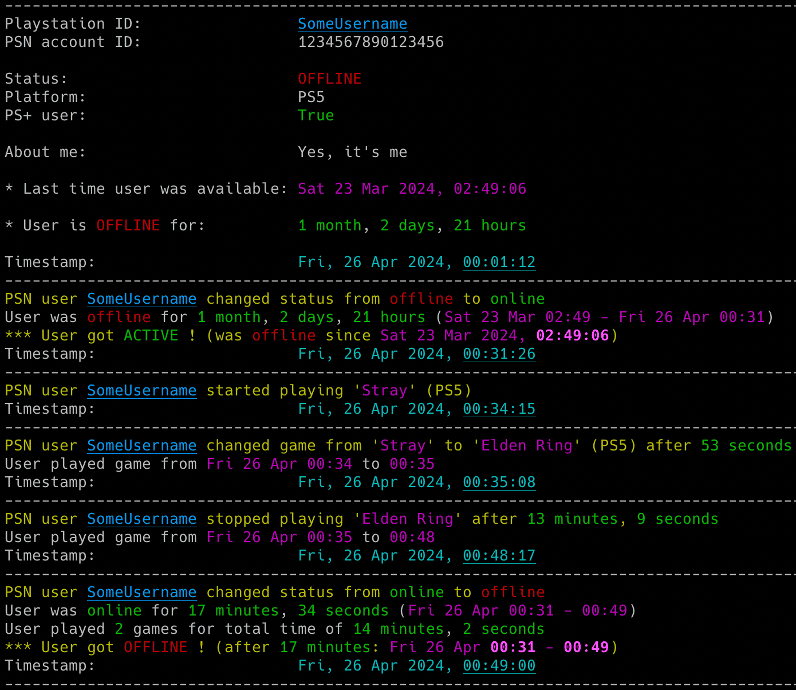
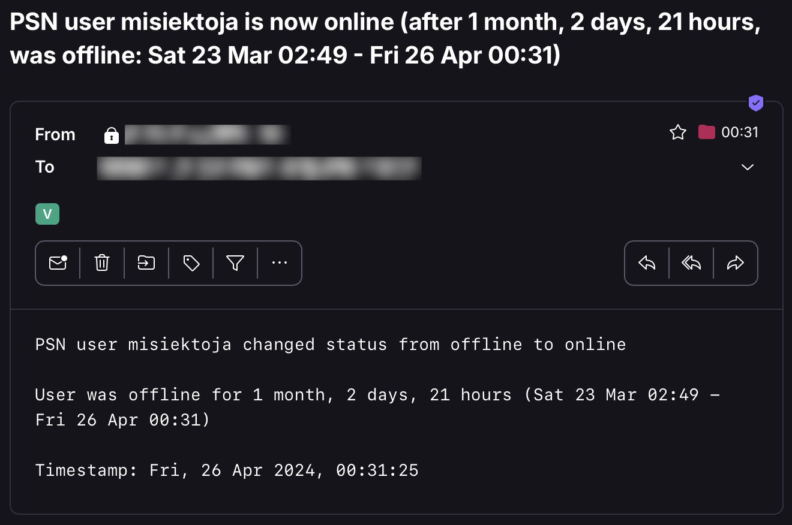

# psn_monitor

psn_monitor is a Python tool that allows for real-time monitoring of Sony PlayStation (PSN) players' activities.

## Features

- Real-time tracking of PlayStation users' gaming activity (including detection when a user gets online/offline or plays games)
- Basic statistics for user activity (duration in different states, time spent playing a game, overall time and number of games played in a session etc.)
- Email notifications for various events (player gets online/offline, starts/finishes/changes a game, errors)
- Saving all user activities with timestamps to a CSV file
- Possibility to control the running copy of the script via signals

<p align="center">
   
</p>

## Change Log

Release notes can be found [here](RELEASE_NOTES.md)

## Requirements

The tool requires Python 3.10 or higher.

It uses [PSNAWP](https://github.com/isFakeAccount/psnawp) library, also requests, pytz, tzlocal and python-dateutil.

It has been tested successfully on:
- macOS (Ventura, Sonoma & Sequoia)
- Linux:
   - Raspberry Pi Bullseye & Bookworm
   - Ubuntu 24
   - Kali Linux 2024
- Windows (10 & 11)

It should work on other versions of macOS, Linux, Unix and Windows as well.

## Installation

Install the required Python packages:

```sh
python3 -m pip install requests python-dateutil pytz tzlocal PSNAWP
```

Or from requirements.txt:

```sh
pip3 install -r requirements.txt
```

Copy the *[psn_monitor.py](psn_monitor.py)* file to the desired location. 

You might want to add executable rights if on Linux/Unix/macOS:

```sh
chmod a+x psn_monitor.py
```

## Configuration

Edit the *[psn_monitor.py](psn_monitor.py)* file and change any desired configuration variables in the marked **CONFIGURATION SECTION** (all parameters have detailed description in the comments).

### PSN npsso code

Log in to your [My PlayStation](https://my.playstation.com/) account.

In another tab, go to: [https://ca.account.sony.com/api/v1/ssocookie](https://ca.account.sony.com/api/v1/ssocookie)

Copy the value of **npsso** code.

Change the **PSN_NPSSO** variable to respective value (or use **-n** parameter).

The refresh token that is generated from npsso should be valid for 2 months. You will be informed by the tool once the token expires (proper message on the console and in email if errors notifications have not been disabled via **-e** parameter).

### Timezone

The tool will try to automatically detect your local time zone so it can convert PSN API timestamps to your time. 

In case you want to specify your timezone manually then change **LOCAL_TIMEZONE** variable from *'Auto'* to specific location, e.g.

```
LOCAL_TIMEZONE='Europe/Warsaw'
```

In such case it is not needed to install *tzlocal* pip module.

### User privacy settings

In order to monitor PlayStation user activity, proper privacy settings need to be enabled on the monitored user account, i.e. in PlayStation *'Account Settings'* -> *'Privacy Settings'* -> *'Personal Info | Messaging'*, the value in section *'Online Status and Now Playing'* should be set to *'Friends only'* (if you are friends) or to *'Anyone'*. 

### SMTP settings

If you want to use email notifications functionality you need to change the SMTP settings (host, port, user, password, sender, recipient) in the *[psn_monitor.py](psn_monitor.py)* file. If you leave the default settings then no notifications will be sent.

You can verify if your SMTP settings are correct by using **-z** parameter (the tool will try to send a test email notification):

```sh
./psn_monitor.py -z
```

### Other settings

All other variables can be left at their defaults, but feel free to experiment with it.

## Getting started

### List of supported parameters

To get the list of all supported parameters:

```sh
./psn_monitor.py -h
```

or 

```sh
python3 ./psn_monitor.py -h
```

### Monitoring mode

To monitor specific user activity, just type the PlayStation (PSN) id (**misiektoja** in the example below):

```sh
./psn_monitor.py misiektoja
```

The tool will run infinitely and monitor the player until the script is interrupted (Ctrl+C) or killed the other way.

You can monitor multiple PSN players by spawning multiple copies of the script. 

It is suggested to use sth like **tmux** or **screen** to have the script running after you log out from the server (unless you are running it on your desktop).

The tool automatically saves its output to *psn_monitor_{psnid}.log* file (can be changed in the settings via **PSN_LOGFILE** variable or disabled completely with **-d** parameter).

The tool also saves the timestamp and last status (after every change) to *psn_{psnid}_last_status.json* file, so the last status is available after the restart of the tool.

## How to use other features

### Email notifications

If you want to get email notifications once the user gets online or offline use **-a** parameter:

```sh
./psn_monitor.py misiektoja -a
```

Make sure you defined your SMTP settings earlier (see [SMTP settings](#smtp-settings)).

Example email:

<p align="center">
   
</p>

If you want to be informed when user starts, stops or changes the played game then use **-g** parameter:

```sh
./psn_monitor.py misiektoja -g
```

### Saving gaming activity to the CSV file

If you want to save all reported activities of the PSN user, use **-b** parameter with the name of the file (it will be automatically created if it does not exist):

```sh
./psn_monitor.py misiektoja -b psn_misiektoja.csv
```

### Check intervals

If you want to change the check interval when the user is online to 30 seconds use **-k** parameter and when the user is offline to 2 mins (120 seconds) use **-c** parameter:

```sh
./psn_monitor.py misiektoja -k 30 -c 120
```

### Controlling the script via signals (only macOS/Linux/Unix)

The tool has several signal handlers implemented which allow to change behavior of the tool without a need to restart it with new parameters.

List of supported signals:

| Signal | Description |
| ----------- | ----------- |
| USR1 | Toggle email notifications when user gets online or offline (-a) |
| USR2 | Toggle email notifications when user starts/stops/changes the game (-g) |
| TRAP | Increase the check timer for player activity when user is online (by 30 seconds) |
| ABRT | Decrease check timer for player activity when user is online (by 30 seconds) |

So if you want to change functionality of the running tool, just send the proper signal to the desired copy of the script.

I personally use **pkill** tool, so for example to toggle email notifications when user gets online or offline, for the tool instance monitoring the *misiektoja* user:

```sh
pkill -f -USR1 "python3 ./psn_monitor.py misiektoja"
```

As Windows supports limited number of signals, this functionality is available only on Linux/Unix/macOS.

### Other

Check other supported parameters using **-h**.

You can combine all the parameters mentioned earlier.

## Coloring log output with GRC

If you use [GRC](https://github.com/garabik/grc) and want to have the tool's log output properly colored you can use the configuration file available [here](grc/conf.monitor_logs)

Change your grc configuration (typically *.grc/grc.conf*) and add this part:

```
# monitoring log file
.*_monitor_.*\.log
conf.monitor_logs
```

Now copy the *conf.monitor_logs* to your *.grc* directory and psn_monitor log files should be nicely colored when using *grc* tool.

## License

This project is licensed under the GPLv3 - see the [LICENSE](LICENSE) file for details
